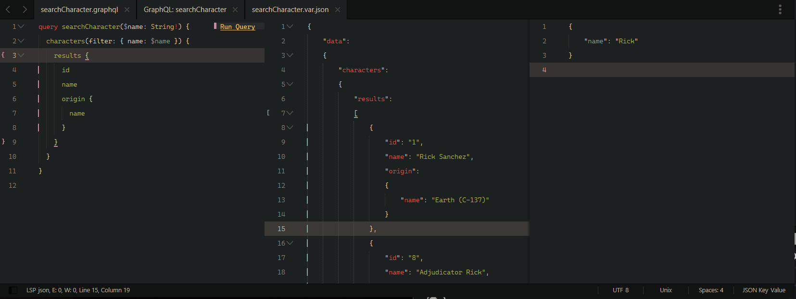

### GraphQL Playground

---

❄ GraphQL development inside Sublime Text

##### Installation

- Install from `packagecontrol.io` or unpack the [zip](https://github.com/kapitanluffy/sublime-graphql-playground/archive/master.zip) in your packages directory

##### Usage

1. Run `Graphql Playground: Create config` from the command palette

2. Install [LSP-graphql](https://github.com/sublimelsp/LSP-graphql) for full GraphQL language support (autocomplete, diagnostics..)

2. Open a graphql file

#### Keybindings

- Open/close query variables (`ctrl+y`, `v`)

- Create graphql config (`ctrl+y`, `c`)

- Run query under the cursor (`ctrl+enter`)

- Move between selected views ( `alt+1`, `alt+2`, `alt+3` )

##### Support

You can always support me via [Patreon](https://www.patreon.com/kapitanluffy) or [Ko-fi](https://www.ko-fi.com/kapitanluffy)

##### License

[MIT](LICENSE)
